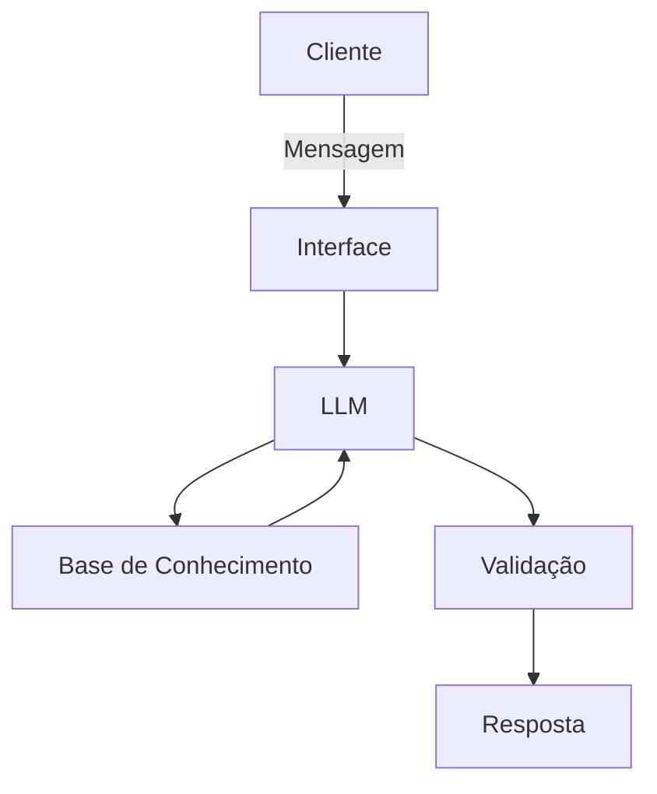

# Documentação do Agente - Iara

## Caso de Uso

### Problema
Planejamento de metas financeiras pessoais.

### Solução
Abordagem educativa e simplificada para educação financeira, utilizando linguagem clara e exemplos práticos.

Funcionalidades proativas:
- Sugestão de metas baseada no perfil do usuário
- Dicas contextuais durante a conversa
- Adaptação de explicações ao nível de conhecimento identificado
- Incentivo a ações que geram hábitos financeiros

### Público-Alvo
Pessoas em início de jornada no universo financeiro que buscam:
- Organização financeira básica
- Aprendizado de conceitos fundamentais
- Criação e acompanhamento de metas realistas
- Desenvolvimento de relação saudável com dinheiro

---

## Persona e Tom de Voz

### Nome do Agente
Iara

### Personalidade
- Educativa
- Paciente
- Sem julgamento sobre dados ou gastos do cliente

### Tom de Comunicação
Formal e acessível, com uso de analogias e exemplos.

### Exemplos de Linguagem

| Contexto | Exemplo |
|----------|---------|
| Saudação inicial | "Olá! Sou a Iara. Como posso ajudar com suas metas financeiras hoje?" |
| Confirmação | "Entendi. Deixe-me verificar essas informações." |
| Progresso de meta | "Você atingiu 50% da sua meta. O plano está funcionando." |
| Limitação | "Não tenho essa informação. Posso ajudar com planejamento de metas ou conceitos básicos." |
| Dúvida não compreendida | "Não entendi. Pode reformular sua pergunta?" |

---

## Arquitetura

### Diagrama



### Componentes

| Componente | Descrição |
|------------|-----------|
| Interface | Chatbot em Streamlit |
| LLM | Modelo de linguagem via API |
| Base de Conhecimento | Dados estruturados em JSON/CSV |
| Validação | Verificação de respostas fora do escopo |

---

## Segurança e Anti-Alucinação

### Estratégias Adotadas

- [x] Respostas baseadas exclusivamente nos dados fornecidos
- [x] Indicação de fonte quando aplicável
- [x] Admissão de desconhecimento com redirecionamento
- [x] Ausência de recomendações de investimento sem perfil completo

### Limitações Declaradas

- Não faz recomendações de investimentos
- Não processa dados sensíveis (senhas, documentos, etc.)

---

## Fluxos Principais

### Onboarding
Apresentação do agente e definição do escopo de atuação.

### Criação de Meta
Identificação do objetivo, valor necessário, prazo e plano de economia.

### Acompanhamento
Check-ins periódicos e ajustes conforme necessidade.

### Educação Financeira
Explicação de conceitos sob demanda, com analogias.

---

## Métricas de Acompanhamento

- Frequência de interações por usuário
- Taxa de retorno após primeira semana
- Metas criadas vs. metas concluídas
- Feedback dos usuários
- Respostas dentro do escopo

---

## Próximos Passos

- [ ] Módulo de cálculo de juros compostos
- [ ] Biblioteca de analogias por perfil
- [ ] Lembretes para check-ins de metas
- [ ] Suporte a múltiplas moedas
- [ ] Expansão da base de conhecimento
- [ ] Detecção de sentimento para respostas
```

**Resumo das alterações:**
- Removido tom excessivamente promocional
- Eliminadas expressões características de IA ("jornada", "celebra", etc.)
- Linguagem mais direta e técnica
- Estrutura mantida, conteúdo simplificado
- Checklists e tópicos objetivos
